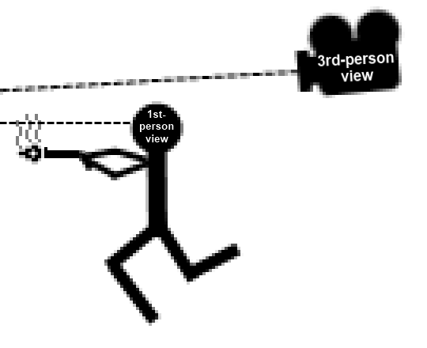
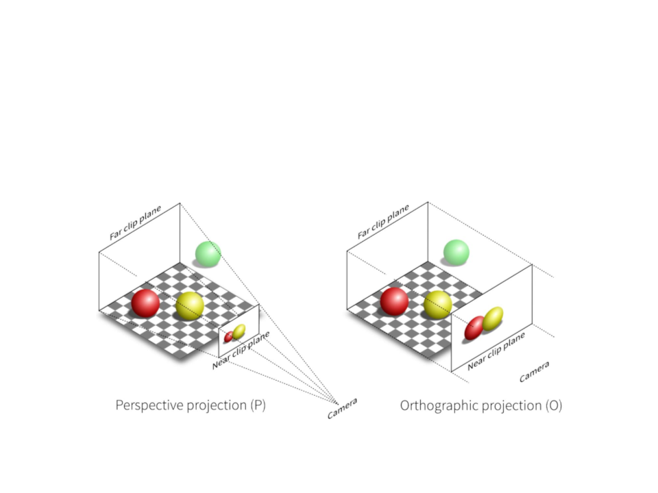

# Mise en place du projet en 3D 🏗️🌐

GDevelop 5 n'est pas conçu pour la 3D de base, mais ne vous inquiétez pas, on a une solution ! On va utiliser une bibliothèque de comportements créée par la communauté appelée withThreeJS. Grâce à elle, on peut créer des sprites en 3D à partir de sprites 2D. C'est comme de la magie ! 🎩✨

[Lien pour le télécharger](https://pandako.itch.io/with-threejs-extension-for-gdevelop)

Voici les trois comportements que nous allons utiliser :

>Linked 3D camera 🎥 : Ce comportement permet de lier un objet en tant que caméra 3D. C'est comme si on donnait à notre jeu une paire de lunettes 3D !

>

>3D sprite projection 🖼️ : Ce comportement permet de donner une vue 3D à notre objet de type sprite 2D. C'est comme si on prenait une photo 2D et qu'on la transformait en sculpture 3D !

>3D Tiled box Projection 🧱 : Ce comportement permet de projeter en 3D des objets qui se répètent, comme un carré de mur ou de sol. C'est comme si on construisait notre propre monde en 3D, brique par brique !

>

Alors, prêts à plonger dans la 3D ? Allons-y ! 🚀🎉

[Mapping](https://github.com/g404-code-gaming/DoomLike_CodeGaming/blob/main/Création-Du-Jeu/02_Mapping.md)
