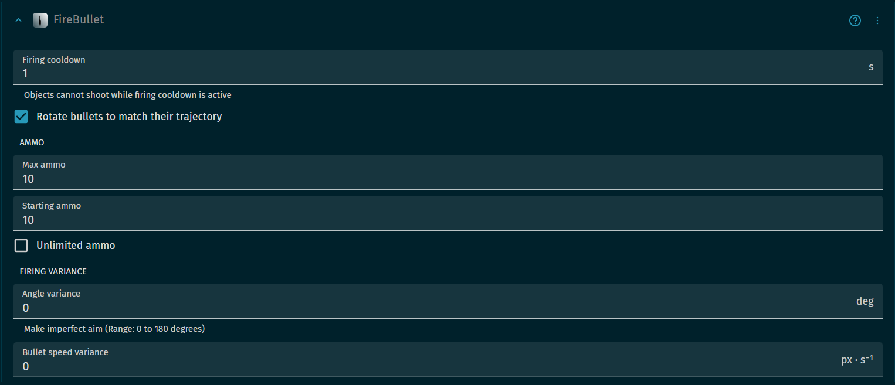
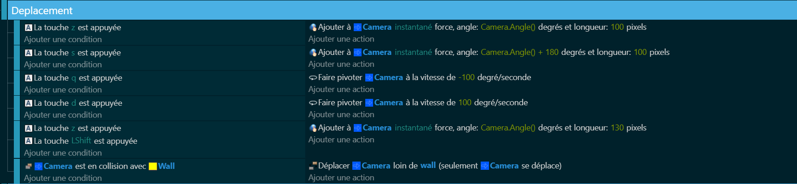
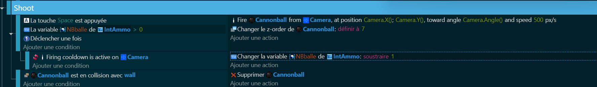

# Player Principale (Déplacement FPS + tir) 🏃‍♂️🔫

Maintenant que notre monde est construit, il est temps de donner vie à notre personnage principal. Dans cette partie, nous allons programmer les mouvements de notre personnage en vue à la première personne (FPS) et lui donner la capacité de tirer. C'est comme si on lui donnait des jambes pour courir et des bras pour tirer ! 💪🦵

Pour cela, nous allons avoir besoin de plusieurs comportements. Les comportements sont comme des instructions qui disent à notre personnage comment se comporter. Voici les comportements dont nous aurons besoin :

>Comportements de déplacement : Ces comportements vont contrôler la vitesse et la direction de notre personnage que l'on developperas dans la partie code.
>
>Comportements de tir : Ces comportements vont contrôler la vitesse et la direction des tirs de notre personnage.
>
>
>

Avant de passer à la partie code, nous devons initialiser certaines variables. Les variables sont comme des boîtes dans lesquelles nous pouvons stocker des informations pour les utiliser plus tard. Voici comment nous initialisons nos variables :

Nous allons initialiser une variable que l'on va appeler "PV" 💗 qui correspondra a notre nombre de vie de notre personnage et ensuite une variable "NBBalle" 💥 sur un objet texte que vous allez créer qui affichera les valeurs du nombre de balles restant.

Maintenant que nous avons défini nos comportements et initialisé nos variables, nous pouvons passer à la partie code. Le code est comme la recette qui dit à notre personnage comment se déplacer et tirer. Voici le code que nous allons utiliser :

## Partie 1: le Déplacement 🏃‍♂️

## Partie 2: le Tir 🔫

Alors, prêts à donner vie à notre personnage ? Allons-y ! 🚀🎉

[UI avec gestion pv + nombre de balle](https://github.com/g404-code-gaming/DoomLike_CodeGaming/blob/main/Création-Du-Jeu/04_UI%20avec%20gestion%20pv%20%2B%20nombre%20de%20balle.md)
