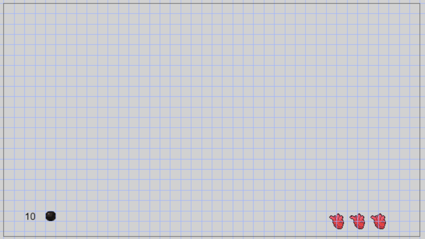
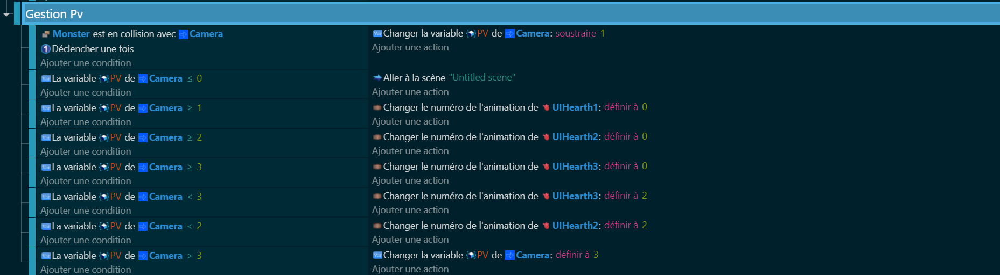

# UI avec gestion pv + nombre de balle 🖥️💔

Maintenant que notre personnage peut se déplacer et tirer, il est temps de créer une interface utilisateur (UI) pour afficher la vie de notre personnage (pv) et le nombre de balles restantes. C'est comme si on construisait le tableau de bord de notre personnage ! 🚀📊

Pour cela, nous allons créer un nouveau calque dans notre jeu spécialement pour l'UI. Un calque est comme une couche transparente que nous pouvons placer au-dessus de notre monde de jeu pour afficher des informations supplémentaires.

Il est important de noter que les objets que nous voulons afficher sur l'UI ne doivent pas hériter des comportements 3D. En effet, l'UI est en 2D et n'a pas besoin de la profondeur supplémentaire que la 3D apporte. C'est comme si on dessinait sur une feuille de papier, pas besoin de 3D ici ! 📝🚫

Alors, prêts à construire notre UI ? Allons-y ! 🚀🎉

Voici un exemple de ce que vous pouriez obtenir en UI

Maintenant passons au code pour réaliser notre compteur de point de vie! 💔

Maintenant que notre personnage principal est prêt à entrer en scène, il est temps de nous occuper de son arme. Plus précisément, nous allons coder l'affichage du nombre de balles restantes. C'est comme si on donnait à notre personnage un compteur pour qu'il sache combien de balles il lui reste à tout moment ! 🎮🔫 Alors, prêts à coder cet affichage ? Allons-y !

Attention l'étape suivante reposeras sur les ennemis la partie la plus importante dans un jeu de tir et la plus longue prenez place a vos clavier et c'est partie !!!!

[Ennemis](https://github.com/g404-code-gaming/DoomLike_CodeGaming/blob/main/Création-Du-Jeu/05_Ennemis.md)
