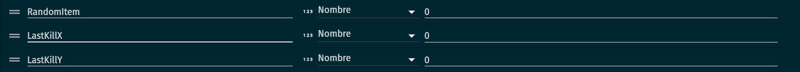
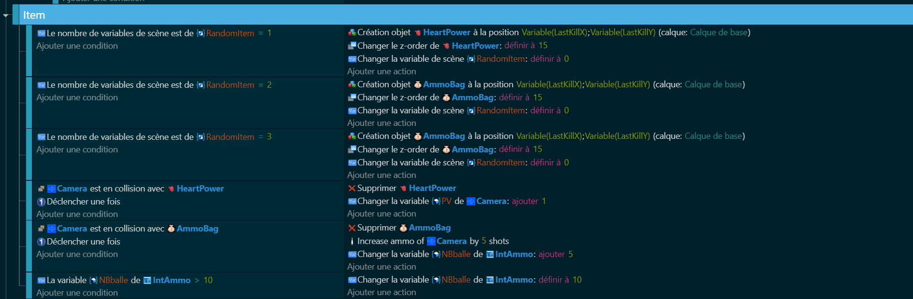

# Item (coeur + sac de munition) ❤️💼

Maintenant que nos ennemis sont prêts à affronter notre personnage, il est temps d'ajouter des items à notre jeu pour aider notre personnage. Nous allons créer deux types d'items : un coeur pour regagner de la vie et un sac de munitions pour recharger notre arme. C'est comme si on laissait des cadeaux pour notre personnage à travers le monde du jeu ! 🎁🌍

## Variables 📊 
Nous allons définir certaines variables pour nos items. Ces variables vont contrôler des choses comme la position de l'item, le type d'item, etc. C'est comme si on réglait les paramètres de nos cadeaux pour qu'ils soient prêts à être ramassés par notre personnage ! 🎯🎁

## Code 💻 
Ensuite, nous allons écrire le code qui contrôle nos items. Ce code va utiliser les variables que nous avons définies pour donner vie à nos items. C'est comme si on écrivait le scénario de nos cadeaux pour qu'ils sachent quoi faire quand notre personnage les ramasse ! 📝🎬

Voici le code que nous allons utiliser :

## A toi de joué

Adapte le jeu afin que le jeu puisse être réalisable comme par exemple à la mort de nos ennemis lâcher un item aléatoirement ou non.

Maintenant que nous avons créé des items pour notre personnage, il est temps de passer à la partie des checkbox. C'est comme si on donnait au joueur un interrupteur pour contrôler certaines parties du jeu ! 🎮🔧 Alors, prêts à créer des check boxes pour notre jeu ? Allons-y ! 🚀🎉

[CheckBox](https://github.com/g404-code-gaming/DoomLike_CodeGaming/blob/main/Création-Du-Jeu/07_CheckBox.md)
