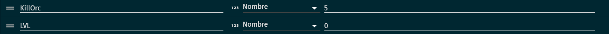
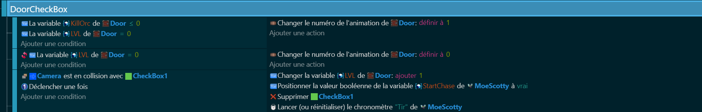

# Check Box ☑️

Maintenant que nos items sont prêts, il est temps d'ajouter une fonctionnalité supplémentaire à notre jeu : une check box. La check box est une case à cocher que le joueur peut activer ou désactiver pour changer certains paramètres du jeu. C'est comme si on donnait au joueur un interrupteur pour contrôler certaines parties du jeu ! 🎮🔧

## Variables 📊 
Nous allons définir certaines variables pour notre check box. Ces variables vont contrôler des choses comme l'état de la check box (activée ou désactivée), la position de la check box, etc.

## Code 💻 
Ensuite, nous allons écrire le code qui contrôle notre check box. Ce code va utiliser les variables que nous avons définies pour donner vie à notre check box. Lorsque le joueur clique sur la check box, le code va changer l'état de la check box et modifier les paramètres du jeu en conséquence.

## Challenge 💻

À toi de créer avec l'aide de cette partie de faire une check box pour préparer le Boss qui arrive ensuite.

Maintenant que nous avons créé des checkbox pour notre jeu, il est temps de passer à la phase finale : le Boss. C'est comme si on mettait le joueur à l'épreuve finale pour voir s'il est digne de terminer notre jeu ! 🎮🏆 Alors, prêts à créer le Boss de notre jeu ? Allons-y ! 🚀🎉

[Boss](https://github.com/g404-code-gaming/DoomLike_CodeGaming/blob/main/Création-Du-Jeu/08_BossFinal.md)
