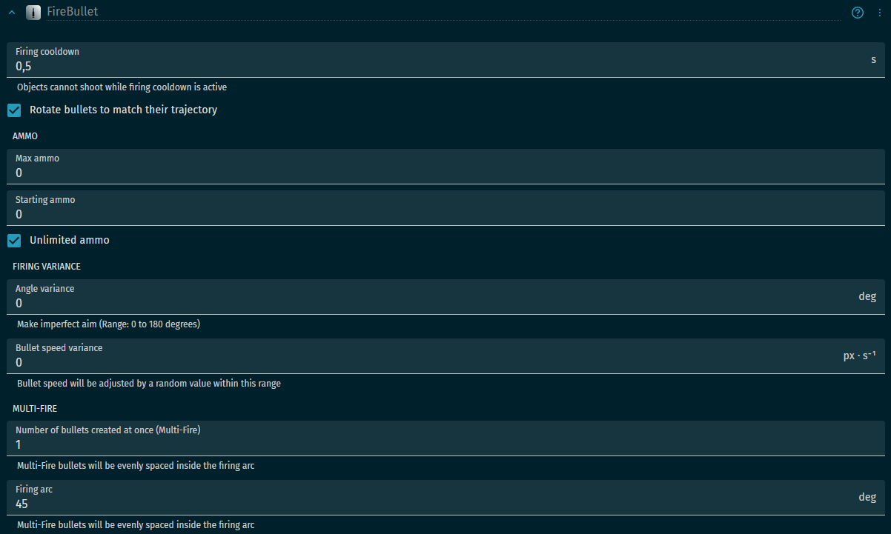
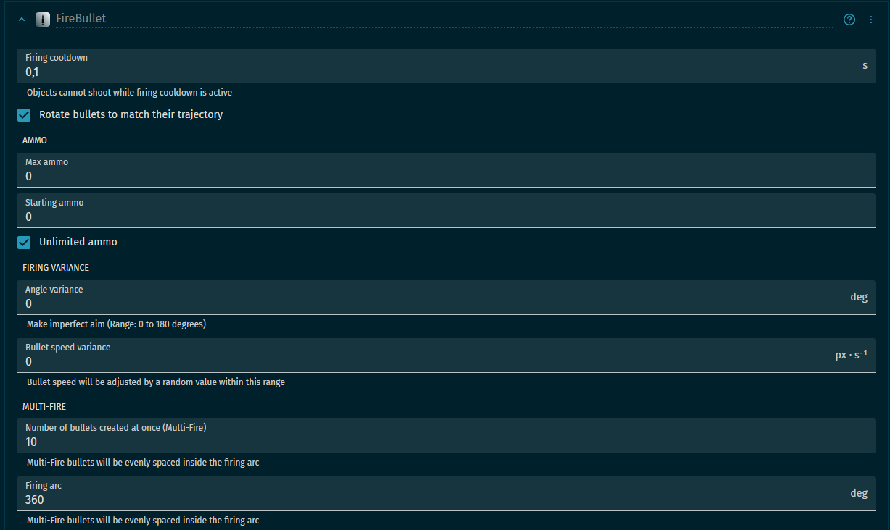
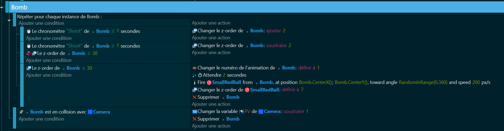
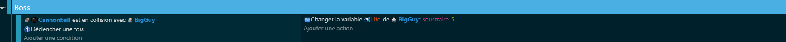
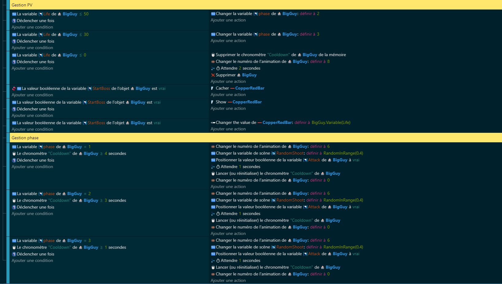

# Boss 👹

Maintenant que nos items et notre check box sont prêts, il est temps de passer à la partie la plus longue : le Boss. Le Boss est l'ennemi final que le joueur doit vaincre pour terminer le jeu. C'est comme si on mettait le joueur à l'épreuve finale pour voir s'il est digne de terminer notre jeu ! 🎮🏆

## Variables 📊 
Nous allons définir certaines variables pour notre Boss. Ces variables vont contrôler des choses comme la santé du Boss, sa phase d'attaque, etc.

Voici les variables que nous allons utiliser :

>Life : Cette variable contrôle la santé du Boss. Elle diminue lorsque le Boss est touché par un tir du joueur.
>
>Attack : Cette variable contrôle si le Boss est en train d'attaquer ou non. Elle est définie sur "True" lorsque le Boss commence à attaquer et sur "False" lorsque le Boss arrête d'attaquer.
>
>StartBoss : Cette variable contrôle si le Boss a commencé à attaquer ou non. Elle est définie sur "True" lorsque le Boss commence à attaquer et sur "False" lorsque le Boss arrête d'attaquer.
>
>phase : Cette variable contrôle la phase d'attaque du Boss. Elle change en fonction de la santé du Boss et détermine le comportement du Boss pendant l'attaque.
>
>RandomShoot : cette variable sera placée en tant que variable de scène, elle permettra au boss de tirer plusieurs types de projectiles.

## Comportements 🧠
Nous allons ajouter un comportements aux canon du Boss afin qu'il puisse attaquer.

#### Canon

#### Bombe

## Code 💻 

Enfin, nous allons écrire le code qui contrôle notre Boss. Ce code va utiliser les variables et les comportements que nous avons définis pour donner vie à notre Boss.

### Attaque du Boss 

Comment le Boss attaque le joueur. Cela comprendra comment le Boss utilise son canon pour tirer des bombes sur le joueur.

### Réaction du Boss aux dégâts 

Comment le Boss réagit lorsqu'il est touché par le joueur.

### Gestion des PV et phase du Boss 

Comment le jeu gère la santé du Boss et change sa phase d'attaque en fonction de sa santé.

[End](https://github.com/g404-code-gaming/DoomLike_CodeGaming/blob/main/Création-Du-Jeu/09_Bravo.md)
